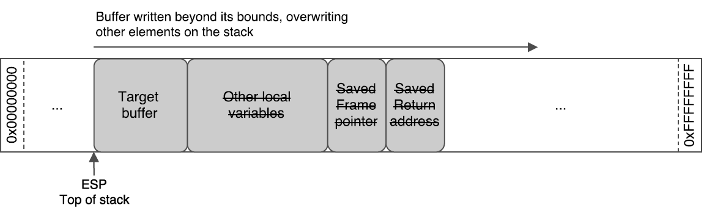

# WS07: Memory Corruption (optional)

## A: Stack corruption: explanation

A buffer allocated on the stack has a finite size as shown in the diagram below:


A buffer overflow takes place when the size of the data written in a buffer is actually greater than its size, hence overwriting other values on the stack as shown the next diagram.



Buffer overflows can happen when reading files from disk, accepting user input or receiving packets from the network that are not formatted as the developer was expecting.

### GCC Stack Smashing Protection (SSP)
Note: For this worksheet GCC 5.4.0 was used.

Stack Smashing Protection (SSP) is a security feature that attempts to mitigate stack-based buffer overflows by placing a canary value on the stack right after the function return pointer. This value is checked before the function returns and if a buffer overflow occurs, the canary value is overwritten and the program is crashed. This extra checking results in a small performance cost.

Beginning with GCC 4.8.3, SSP is enabled by default. The 4.8 series enables ```-fstack-protector``` while 4.9 series and later enables ```-fstack-protector-strong```. SSP can be disabled by passing the command line argument ```-fno-stack-protector``` when compiling as seen below:

```$ gcc -Wall -fno-stack-protector -o overflow overflow.c```

### Stack corruption: buffer overflows 
Consider the code in [overflow.c](./7a/overflow.c) where a password is being read from console. The buffer where the input will be held is 11 bytes long (10 chars + NULL termination). Using the provided [makefile](./7a/makefile), this code is compiled both with the default configuration (output = overflow_ssp) and with SSP disabled (output = overflow). GCC tries to help us out by displaying the warning below:

```warning: the 'gets' function is dangerous and should not be used.```

Walkthrough: What should happen in the following cases?

#### Password shorter than 11 characters
Both executables behave as expected, as seen below.
```
$ ./overflow_ssp
Enter password: 12345
Incorrect Password!

$ ./overflow
Enter password: 12345
Incorrect Password!
```
#### Password longer than 30 characters
When using passwords 30 characters or longer, both versions of the executable crash. When SSP is enable it kicks in an expected. In the other version the long password damages the structure of the stack resulting in a segmentation fault.
```
$ ./overflow_ssp
Enter password: 12345678901234567890123456789012345
Incorrect Password!
*** stack smashing detected ***: ./overflow_ssp terminated
Aborted (core dumped)

$ ./overflow
Enter password: 12345678901234567890123456789012345
Incorrect Password!
Performing tasks that require password...
Segmentation fault (core dumped)
```
#### Task
Change the code so that stack corruption never takes place by using a safe alternative to the deprecated gets().

## B: Variable scope
Get a copy of [scope.c](./7b/scope.c) and its [makefile](./7b/makefile). The global variables ```pointer_heap``` and ```pointer_stack``` are character pointers. Inside ```init_pointers()``` the first is set to point to an address in the heap while the second points to an address on the stack. ```init_pointers()``` returns to main and ```print_pointers()``` is called soon after. This function prints the contents at the two addresses resulting in output similar to the following:
```
$ ./scope 
pointer_heap: testString 
pointer_stack: testString 
```
As you will notice the program prints both string (even though it is possible for the output to be inconsistent between runs, and an intermittant problem  is one of the most tedious tasks faced by programmers). 

Uncommenting line 20, building and running again produces a different output:
```
$ ./scope 
pointer_heap: testString 
pointer_stack:
```
### Explaination
The diagram below shows the change in the stack content during program execution.


You can see that the stack frame of ```print_pointers()``` occupies the space previously used by the stack frame of ```int_pointers()```. In the first runs (line 20 commented) the stack frame of ```print_pointers()``` did not contain any local variables. ```pointer_stack``` points to a variable which is out of scope when ```int_pointers()``` returns and this is bad practice (and could produce inconsistent output).

During the second run, a local variable (100 bytes all set to 0) is declared and it overwrites the previous content. This results in the empty string in the second output. Again here we are using a variable that is out of scope and such behaviour leads to the modified value.


References:  
For more information about SSP options, refer to the GCC Manual, or the following articles.
* http://en.wikipedia.org/wiki/Buffer_overflow_protection
* http://en.wikipedia.org/wiki/Stack_buffer_overflow
* https://securityblog.redhat.com/tag/stack-protector
* http://www.outflux.net/blog/archives/2014/01/27/fstack-protector-strong
